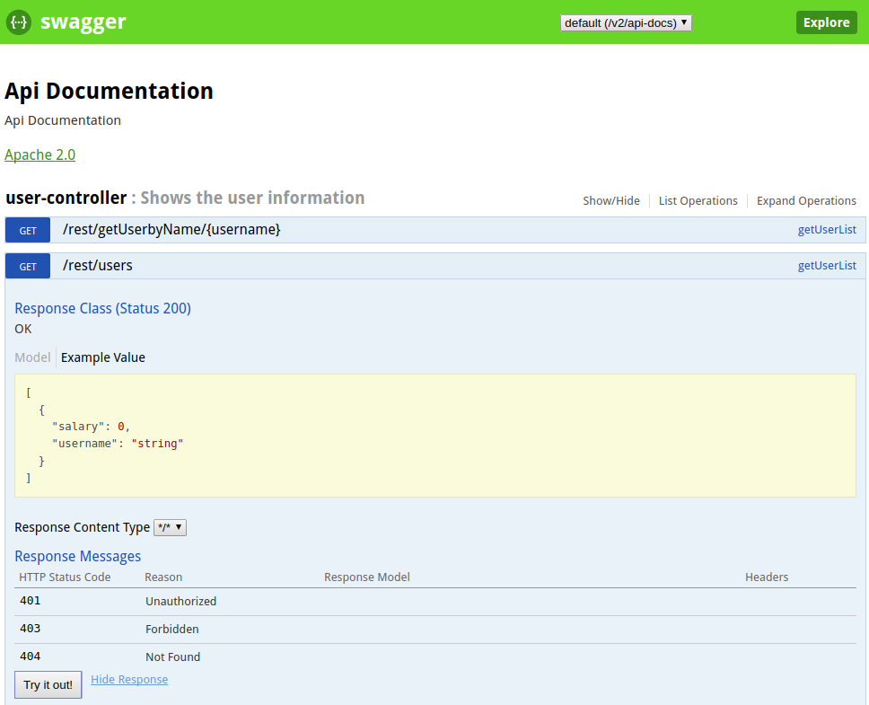

# Springboot Swagger Example #

This is the demo project of Springboot Rest API using Swagger.

* Swagger Service URL : http://localhost:8085/swagger-ui.html
* The below dependencies are added to implement Swagger in Springboot
* Implementated Swagger in SpringBoot Rest Controller
* Swagger provides several features to implement the REST API.
    * Documentation like REST API
    * Everyone can understand the API very easily from the UI itself.
    * We can do the testing of each service method from the UI itself. 
    
```
<!-- Swagger dependencies -->
		<dependency>
			<groupId>io.springfox</groupId>
			<artifactId>springfox-swagger2</artifactId>
			<version>2.7.0</version>
		</dependency>
		<dependency>
			<groupId>io.springfox</groupId>
			<artifactId>springfox-swagger-ui</artifactId>
			<version>2.7.0</version>
		</dependency>
		
```

# Swagger #
Swagger is the world’s largest framework of API developer tools for the OpenAPI Specification(OAS), enabling development across the entire API lifecycle, from design and documentation, to test and deployment.



# Screenshot - Springboot Swagger #

### Happy Coding ###
